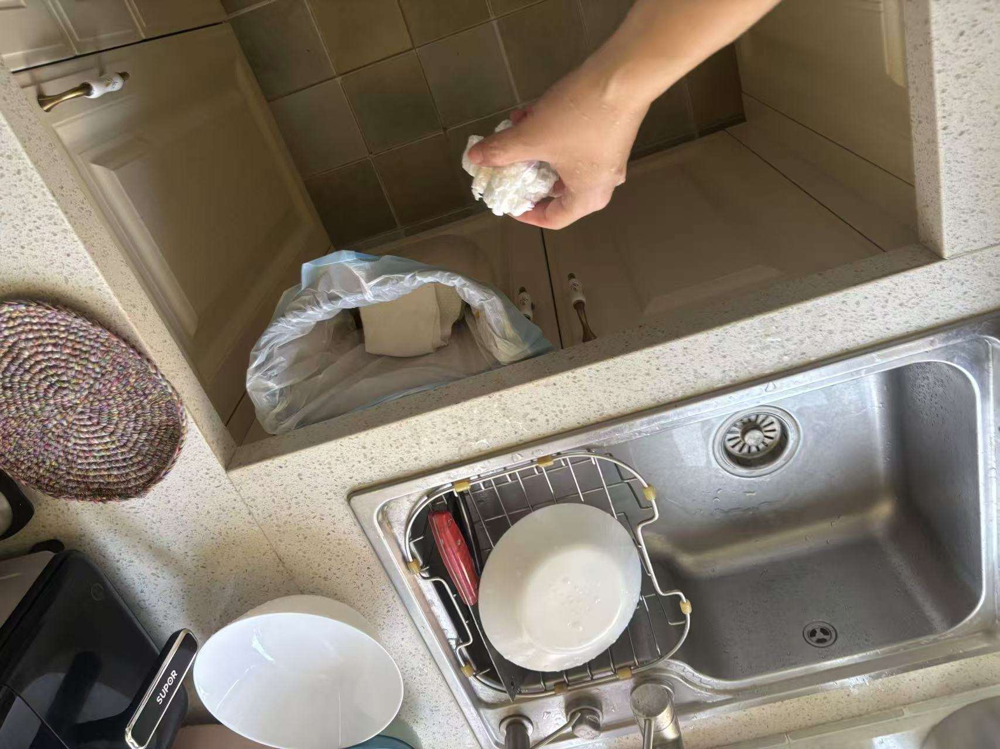
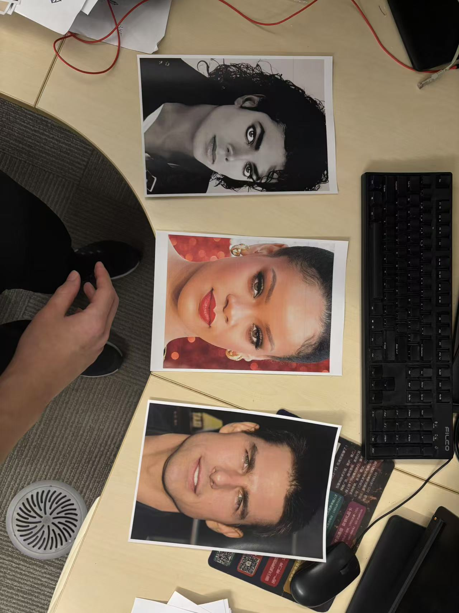

# Human Hand Inference and Visualization

This directory contains test cases and output video samples demonstrating the model's trajectory generation performance under the full multi-step reverse diffusion process (10 DDIM steps).

Evaluating checkpoints based on visual trajectory generation is crucial because a lower mathematical pretraining loss (single-step noise prediction) does not guarantee that the model has learned physically smooth or geometrically accurate trajectories. The visualizations here provide a qualitative baseline of convergence progress across different checkpoint milestones (10k steps and 16k steps) compared to the Author's reference 85k model.

All visual inference runs can be generated using [this notebook](../notebooks/inference.ipynb) or the [prediction script](../scripts/inference_human_prediction.py).

---

## Example 1: Trash Disposal (Left Hand Action)

* **Scenario**: First-person kitchen setting. The left hand holds a piece of crumpled paper above a trash bin lined with a plastic bag.
* **Input Image**: 
* **Target Instruction**: `"Left: Put the trash into the garbage. Right: None."`
* **Output Videos**:
    * 10k checkpoint:

        https://github.com/user-attachments/assets/a1b27425-ed4c-40d3-9424-13062ec0c2f8

    * 16k checkpoint:

        https://github.com/user-attachments/assets/023f3ced-cc60-432b-8045-4b6b72134e61

    * Author's 85k checkpoint:

        https://github.com/user-attachments/assets/4e1c2765-92c3-41e0-8b9f-ce04cff40cea

    
Show output videos (HTML-supported viewer)

    <ul>
        <li><strong>10k checkpoint</strong>: <video controls src="./predictions/0001_cp10k.mp4" alt="example 1 output"></video></li>
        <li><strong>16k checkpoint</strong>: <video controls src="./predictions/0001_cp16k.mp4" alt="example 1 output"></video></li>
        <li><strong>Author's 85k checkpoint</strong>: <video controls src="./predictions/0001_hf85k.mp4" alt="example 1 output"></video></li>
    </ul>

---

## Example 2: Target Object Grasping (Right Hand Action)

* **Scenario**: Cluttered desk top-down view. The right hand approaches the table surface to pick up a specific card/picture.
* **Input Image**: 
* **Target Instruction**: `"Left hand: None. Right hand: Pick up the picture of Michael Jackson."`
* **Output Videos**:
    * 10k checkpoint:

        https://github.com/user-attachments/assets/5b8e044c-c113-430e-92a4-7e9d3cd3c3ad

    * 16k checkpoint:

        https://github.com/user-attachments/assets/932130c8-04f3-4494-8103-761ba6a94136

    * Author's 85k checkpoint:

        https://github.com/user-attachments/assets/f3523f66-1df1-4ba1-8432-ec7eeaf6ef00

    
Show output videos (HTML-supported viewer)

    <ul>
        <li><strong>10k checkpoint</strong>: <video controls src="./predictions/0002_cp10k.mp4" alt="example 2 output"></video></li>
        <li><strong>16k checkpoint</strong>: <video controls src="./predictions/0002_cp16k.mp4" alt="example 2 output"></video></li>
        <li><strong>Author's 85k checkpoint</strong>: <video controls src="./predictions/0002_hf85k.mp4" alt="example 2 output"></video></li>
    </ul>

---

### Core Observations

1. **10k Steps**: The hand successfully targets the general direction of the object (spatial navigation is initialized), but the final landing orientation or knuckle controls exhibit minor alignment deviations.
2. **16k Steps (Our Checkpoint)**: Generates highly directed, smooth, and anatomically precise trajectories that closely track the physical constraints of the scene.
3. **85k Steps (Author Reference)**: Serves as the generalization gold standard. Our 16k specialized checkpoint shows highly comparable visual trajectory quality to the 85k baseline on these target domains.

Additional output samples are hosted in the [predictions folder](./predictions).
